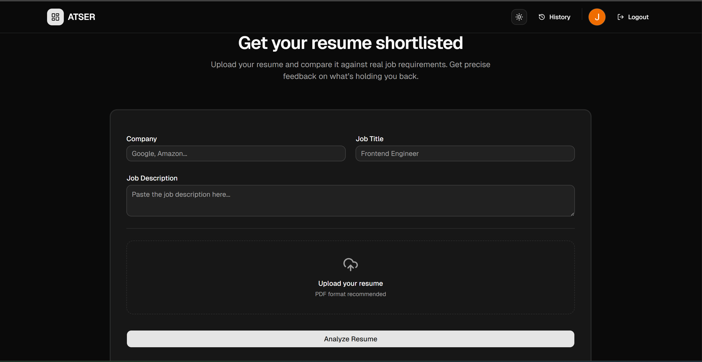
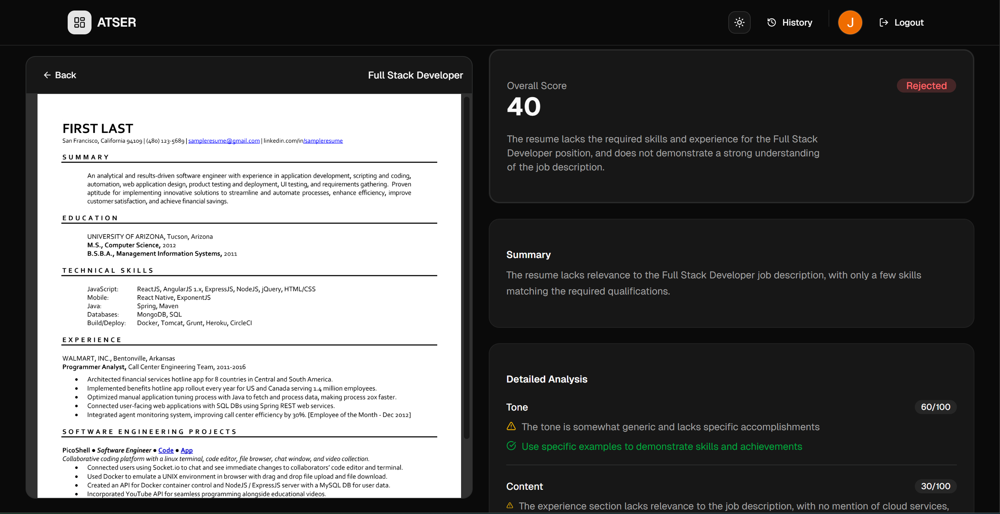
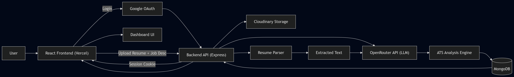

# ATSER - AI Resume Analyzer & ATS Simulator

[](https://opensource.org/licenses/MIT)
[](https://github.com/TDSxJONEY/atser/commits/main)
[](https://atser.vercel.app/)
[](https://atser-backend.onrender.com)

> **An AI-powered web application that analyzes resumes, simulates ATS filtering, and predicts recruiter decisions.**

---

## 🌟 Overview

* **What's the problem?** Most resumes are rejected by Applicant Tracking Systems (ATS) before reaching recruiters, and candidates lack visibility into why.

* **How does this project solve it?** ATSER analyzes resumes against job descriptions using AI, providing ATS scores, keyword insights, and recruiter-style decisions.

* **Who is this for?** Students, job seekers, and professionals aiming to optimize resumes for better job outcomes.

* **Why this project?** It replicates a real hiring pipeline — combining ATS filtering, AI analysis, and recruiter feedback in a single platform.

---

## 📸 Screenshots & Demo

👉 Add screenshots here

**[➡️ Live Demo](https://atser.vercel.app/)**

*Dashboard View* 

*Resume Analysis* 

---

## ✨ Key Features

* **AI Resume Analysis:** Evaluate resumes against job descriptions using LLM-based reasoning  
* **ATS Scoring System:** Generate scores based on relevance, structure, and keyword alignment  
* **Keyword Gap Detection:** Identify missing keywords critical for job matching  
* **Recruiter Decision Simulation:** Predict shortlist/reject outcomes  
* **Google OAuth Authentication:** Secure login using OAuth 2.0 + sessions  
* **Cloud Storage Integration:** Store resumes securely via Cloudinary  
* **Analysis History:** Track past resume evaluations  
* **Modern UI:** Built with Tailwind and shadcn/ui  

---

## 🛠️ Tech Stack & Architecture

### Frontend 🎨

* React (Vite)
* Tailwind CSS + shadcn/ui
* Axios
* React Router

### Backend ⚙️

* Node.js + Express.js
* MongoDB + Mongoose
* Passport.js (Google OAuth 2.0)
* Express-session (cookie-based auth)
* Cloudinary (file storage)
* OpenRouter API (LLM analysis)

### 🧠 Architecture Flow



---

## 🚀 Deployment & DevOps

* **Frontend:** Vercel (Global Edge Deployment)
* **Backend:** Render (Web Service)
* **Authentication:** OAuth + session-based cookies
* **Environment-based config:** Supports both local and production

---

## 💻 Getting Started

### Prerequisites

* Node.js (v18+)
* MongoDB (Atlas/local)
* npm or yarn

### Installation & Setup

#### 1. Clone repository

```bash
git clone [https://github.com/TDSxJONEY/atser.git](https://github.com/TDSxJONEY/atser.git)
cd atser
```

#### 2. Backend Setup

```bash
cd atser-backend
npm install
npm start
```

#### 3. Frontend Setup

```bash
cd atser-frontend
npm install
npm run dev
```

---

### ⚙️ Environment Variables

Create a `.env` file in the respective directories and add the following variables:

#### Backend (`atser-backend/.env`)

```env
MONGO_URI=your_mongodb_url
SESSION_SECRET=your_secret
OPENROUTER_API_KEY=your_key
CLIENT_URL=http://localhost:5173
BASE_URL=http://localhost:5000
CLOUDINARY_CLOUD_NAME=your_cloudinary_name
CLOUDINARY_API_KEY=your_cloudinary_key
CLOUDINARY_API_SECRET=your_cloudinary_secret
GOOGLE_CLIENT_ID=your_google_client_id
GOOGLE_CLIENT_SECRET=your_google_client_secret
```

#### Frontend (`atser-frontend/.env`)

```env
VITE_API_URL=http://localhost:5000
```

---

## 🗺️ Roadmap

* [ ] Resume auto-enhancer (AI rewriting)
* [ ] Role-specific analysis
* [ ] Multi-job comparison
* [ ] Export improved resume

---

## 🤝 Contributing

1. Fork the repo  
2. Create a branch (`git checkout -b feature/new-feature`)  
3. Commit changes (`git commit -m 'Add some feature'`)  
4. Push and open a PR (`git push origin feature/new-feature`)  

---

## 📜 License

This project is licensed under the [MIT License](https://opensource.org/licenses/MIT).

---

## 📧 Contact

**Joney** * GitHub: [@TDSxJONEY](https://github.com/TDSxJONEY)  
* Project Link: [https://github.com/TDSxJONEY/atser](https://github.com/TDSxJONEY/atser)